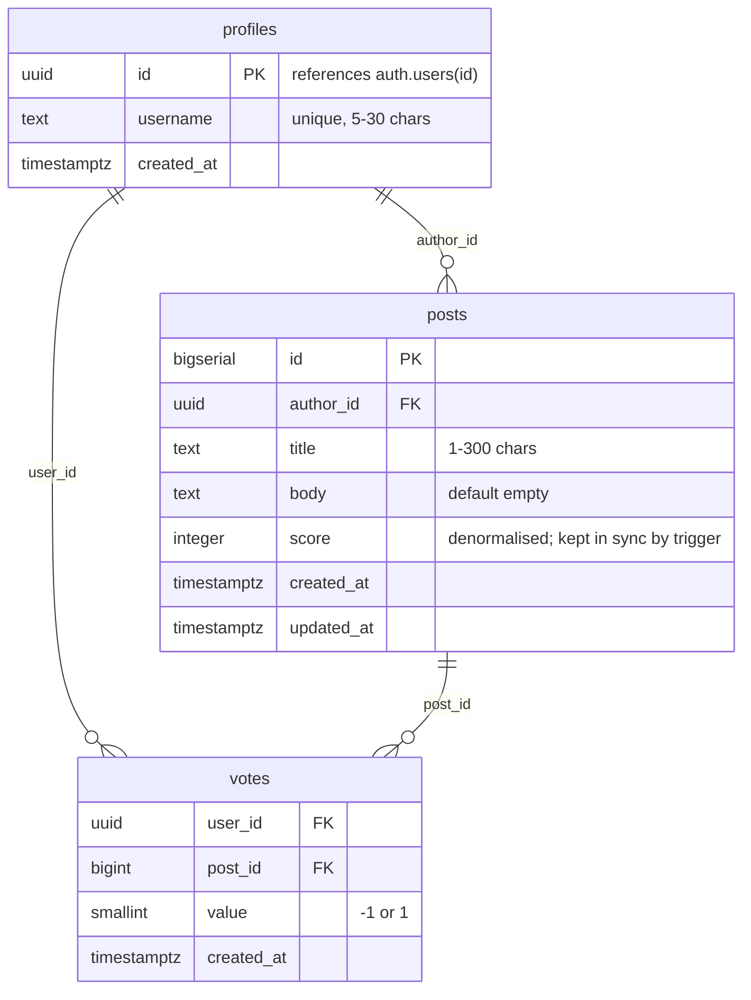

# Database schema

Authoritative SQL lives in `scenius-app/supabase/migrations/0001_init.sql`.
Generated TypeScript types live in `scenius-app/lib/supabase/types.ts` (regenerate with `pnpm db:gen`).

## ER diagram



## Tables

### `public.profiles`
One row per Supabase Auth user. Created automatically by the `on_auth_user_created` trigger which copies `raw_user_meta_data->>'username'` from the `auth.users` insert.

| Column | Type | Notes |
|---|---|---|
| `id` | uuid | PK; FK to `auth.users(id)` |
| `username` | text | unique; 5-30 chars |
| `created_at` | timestamptz | default `now()` |

### `public.posts`

| Column | Type | Notes |
|---|---|---|
| `id` | bigserial | PK |
| `author_id` | uuid | FK to `profiles(id)` |
| `title` | text | 1-300 chars |
| `body` | text | default `''` |
| `score` | integer | denormalised; kept in sync by `votes_score_sync` trigger |
| `created_at` | timestamptz | indexed DESC |
| `updated_at` | timestamptz | |

Indexes: `posts_created_at_idx`, `posts_score_idx`, `posts_author_idx`.

### `public.votes`

| Column | Type | Notes |
|---|---|---|
| `user_id` | uuid | PK part; FK to `profiles(id)` |
| `post_id` | bigint | PK part; FK to `posts(id)` |
| `value` | smallint | CHECK (value IN (-1, 1)) |
| `created_at` | timestamptz | |

Composite PK `(user_id, post_id)` — one vote per user per post.

## Views

### `public.posts_hot`
Exposes all `posts` columns plus `hot_rank`:

```sql
log(greatest(abs(score), 1))
  + (extract(epoch from created_at) - 1700000000) / 45000.0
```

Used by the hot-sort query to avoid repeating the formula.

## Triggers & functions

| Name | Fires on | Purpose |
|---|---|---|
| `votes_score_sync` | AFTER INSERT/UPDATE/DELETE on `votes` | Adjusts `posts.score` by the delta |
| `on_auth_user_created` | AFTER INSERT on `auth.users` | Creates matching `profiles` row |

## RLS summary

| Table | SELECT | INSERT | UPDATE | DELETE |
|---|---|---|---|---|
| `profiles` | public | owner only | owner only | — |
| `posts` | public | authed, as self | owner only | owner only |
| `votes` | public | owner only | owner only | owner only |
